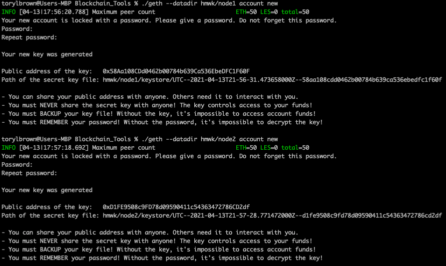
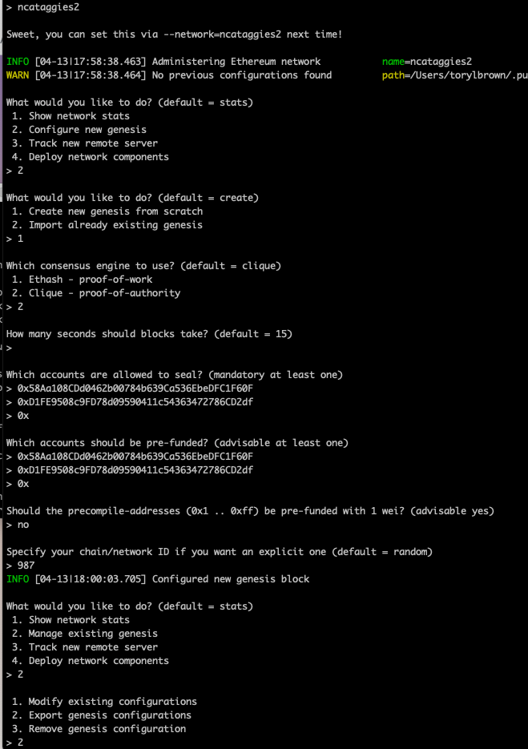
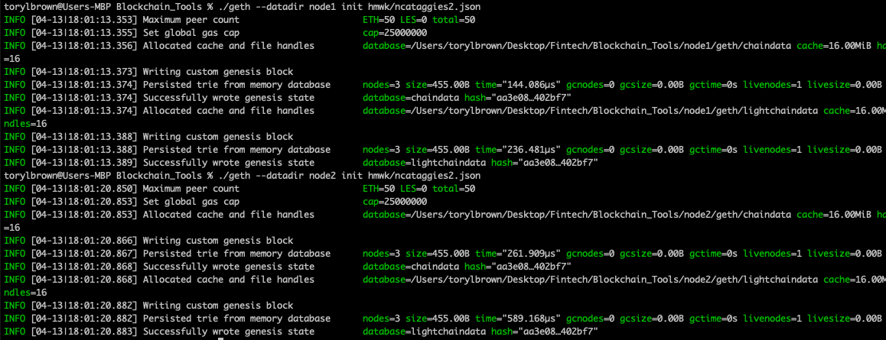
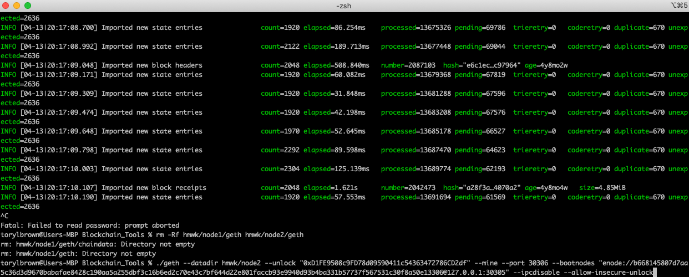
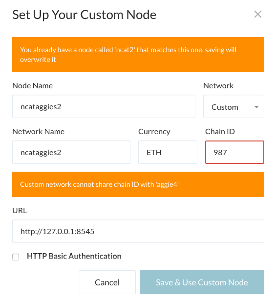

# Proof of Authority Development Chain

For this assignment, I took on the role of a new developer at a small bank.

I attempted to set up a testnet blockchain for my organization.

My plan of attach was to create and submit four deliverables:

* Set up your custom testnet blockchain.

* Send a test transaction.

* Create a repository.

* Write instructions on how to use the chain for the rest of my team.

## Background

I pretended as if I landed a new job at ZBank, a small, innovative bank that is interested in exploring what
blockchain technology can do for them and their customers.

My 1st project at the company was to set up a private testnet that I and my team of developers
can use to explore potentials for blockchain at ZBank.

I decided on setting up a testnet because:

There is no real money involved, which will give my team of developers the freedom to experiment.

Testnets allows for offline development.

## Instructions

### Setup the custom out-of-the-box blockchain

* I created a new project directory for my new network. 

* I ran `puppeth`, named my network, and selected the option to configure a new genesis block.

* I chose the `Clique (Proof of Authority)` consensus algorithm.

*  I pasted both account addresses from the first step one at a time into the list of accounts to seal and pre-fund the account.

* I exported my genesis configurations. 

* I initialized each node.

* I ran the first node, unlocked the account, enabled mining, and the RPC flag.

* I set a different peer port for the second node and used the first node's `enode` address as the `bootnode` flag.

### Send a test transaction

* I used the MyCrypto GUI wallet to connect to the node with the exposed RPC port.

* Import the keystore file from the `node1/keystore` directory into MyCrypto. This will import the private key.

## Result

I got stuck here. My Crypto said that I needed to use another chain/network ID. I tried to go back and create another network, but I got fatal errors when trying to initialize the the new nodes. I used the same process, but the process is very inconsistent. I think that this procedure/routine needs more work.

---
© 2020 Trilogy Education Services, a 2U, Inc. brand. All Rights Reserved.
