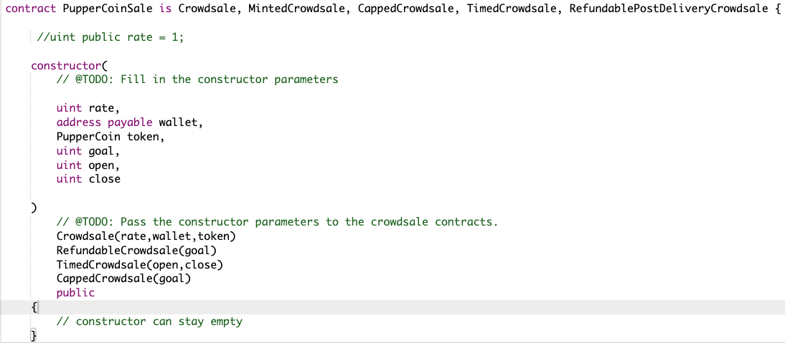
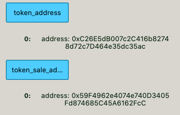
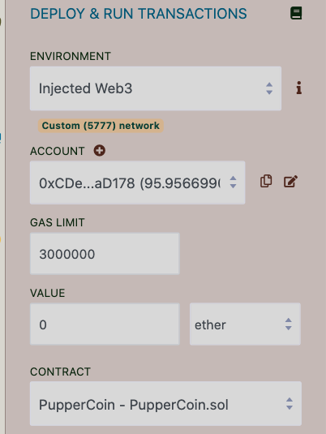
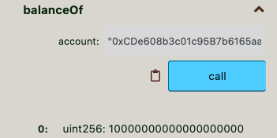
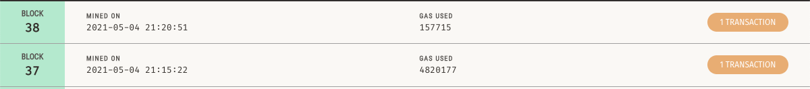

# Unit 21: You sure can attract a crowd!

## Background

My company decided to crowdsale their PupperCoin token in order to help fund the network development.
This network will be used to track the dog breeding activity across the globe in a decentralized way, and allow humans to track the genetic trail of their pets. You have already worked with the necessary legal bodies and have the green light on creating a crowdsale open to the public. However, you are required to enable refunds if the crowdsale is successful and the goal is met, and you are only allowed to raise a maximum of 300 Ether. The crowdsale will run for 24 weeks.

You created an ERC20 token that was be minted through a `Crowdsale` contract that you can leverage from the OpenZeppelin Solidity library.

This crowdsale contract manages the entire process, allowing users to send ETH and get back PUP (PupperCoin).
This contract mints the tokens automatically and distribute them to buyers in one transaction.

I inherited the `Crowdsale`, `CappedCrowdsale`, `TimedCrowdsale`, `RefundableCrowdsale`, and `MintedCrowdsale`.

## Instructions

### Creating your project

Using Remix, I created a file called `PupperCoin.sol` and created a standard `ERC20Mintable` token.

I created a new contract named `PupperCoinCrowdsale.sol`, and prepared it like a standard crowdsale.

### Designing the contracts

#### ERC20 PupperCoin

I simply used the standard `ERC20Mintable` and `ERC20Detailed` contract, hardcoding `18` as the `decimals` parameter, and leaving the `initial_supply` parameter alone.

I filled in the `PupperCoin.sol` file with this [starter code](../Starter-Code/PupperCoin.sol), which contains the complete contract you'll need to work with in the Crowdsale.

#### PupperCoinCrowdsale

I added parameters for all of the features of your crowdsale, such as the `name`, `symbol`, `wallet` for fundraising, `goal`, etc. Feel free to configure these parameters to your liking.

I hardcoded a `rate` of 1, to maintain parity with Ether units (1 PPC per Ether, or 10e18 PuppCoin per wei).
I added the wallet, token info, goal, and the  open & close time as inputs to the Crowdsale contract.
I passed the constructor parameters to the inherited contracts (Crowdsale, RefundableCrowdsale, TimedCrowdsale,CappedCrowdsale).

#### PupperCoinCrowdsaleDeployer

I basedd the code off of the `ArcadeTokenCrowdsaleDeployer`. I leveraged the [OpenZeppelin Crowdsale Documentation](https://docs.openzeppelin.com/contracts/2.x/crowdsales) for an example of a contract deploying another, as well as the starter code provided in [Crowdsale.sol](../Starter-Code/Crowdsale.sol).

I added the name of the coin, the coin's symbol, & the purchase goal. I hard-coded the open & close times.
The Puppercoin token was officially created in this contract.
The PupperCoinSale was also made a contract minter, then renounced its minter role.

These are the wallet addresses coming from the deployer's code:

### Testing the Crowdsale

I tested the Crowdsale using the Remix web-based developer's environment.
I connected my wallet to Remix via Metamask.
Here is a screenshot of the wallet used during the test:

I tested the code by sending 10ETH to get 10PPC (PPC - Symbol for PupperCoin).
The transaction was confirmed here:

The transactions were also confirmed in Ganache:

With some help, I was able to get the code to compile and successfully mint and transact my PupperCoin for ETH.
I am continuing to get a little more comfortable with Remix and making test Crypto transactions.
I continue to look forward to learning more.

