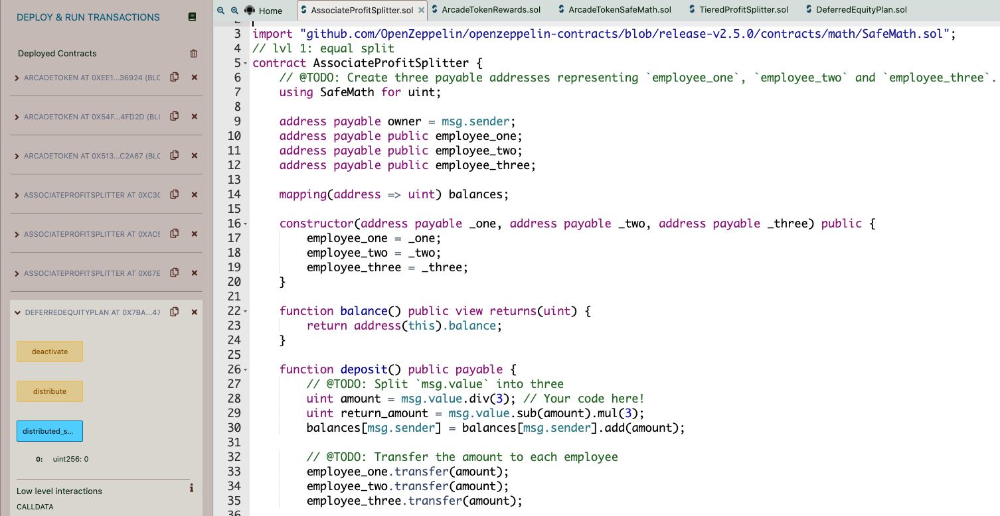
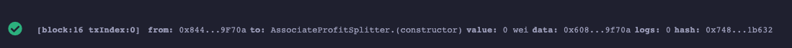
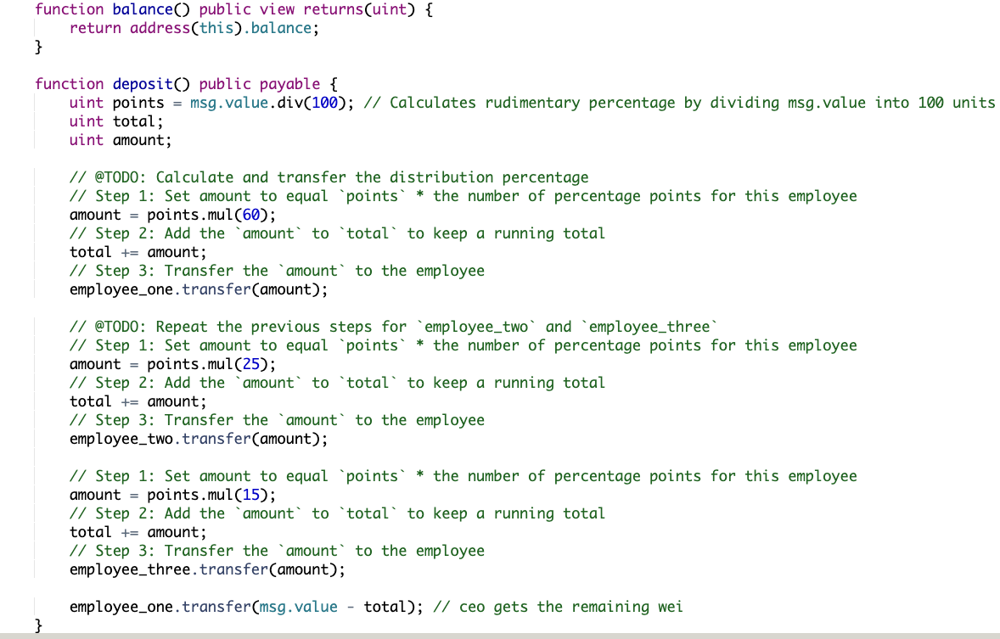
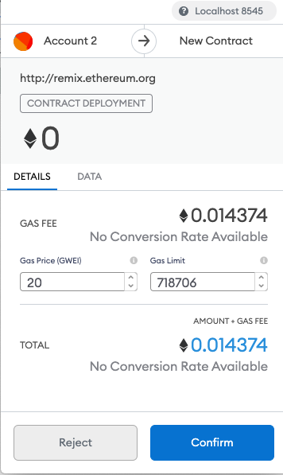
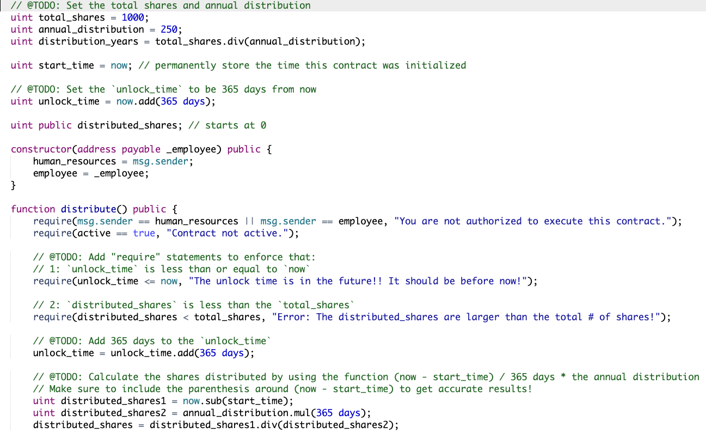
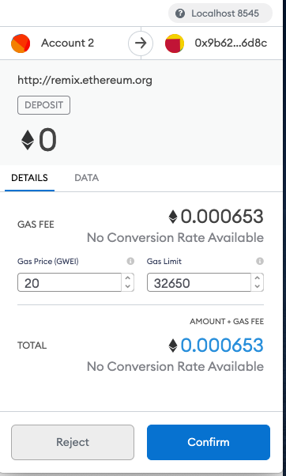

# Unit 20 - "Looks like we've made our First Contract!"

## Background

My new startup created its own Ethereum-compatible blockchain to help connect financial institutions, and my team wants to build smart contracts to automate some company finances to make everyone's lives easier, increase transparency, and to make accounting and auditing practically automatic!

Fortunately, I've been learning how to program smart contracts with Solidity! What I did in this assignment was creating 3 `ProfitSplitter` contracts. These contracts will do several things:

* Pay may Associate-level employees quickly and easily.

* Distribute profits to different tiers of employees.

* Distribute company shares for employees in a "deferred equity incentive plan" automatically.

## Files

* [`AssociateProfitSplitter.sol`](Starter-Code/AssociateProfitSplitter.sol) -- Level 1 starter code.

* [`TieredProfitSplitter.sol`](Starter-Code/TieredProfitSplitter.sol) -- Level 2 starter code.

* [`DeferredEquityPlan.sol`](Starter-Code/DeferredEquityPlan.sol) -- Level 3 starter code.

## Instructions

This assignment had three levels of difficulty, with each contract increasing in complexity and capability. I tried building all three contracts!

* **Level One** is an `AssociateProfitSplitter` contract. This will accept Ether into the contract and divide the Ether evenly among the associate level employees. This will allow the Human Resources department to pay employees quickly and efficiently.

* **Level Two** is a `TieredProfitSplitter` that will distribute different percentages of incoming Ether to employees at different tiers/levels. For example, the CEO gets paid 60%, CTO 25%, and Bob gets 15%.

* **Level Three** is a `DeferredEquityPlan` that models traditional company stock plans. This contract will automatically manage 1000 shares with an annual distribution of 250 over 4 years for a single employee.

### Starting your project

I used the [Remix IDE](https://remix.ethereum.org) and create a new contract called `AssociateProfitSplitter.sol` using the starter code for level one above.

I used the [Ganache](https://www.trufflesuite.com/ganache) development chain, and pointed MetaMask to `localhost:8545`, or replace the port with what I set in my workspace.

### Level One: The `AssociateProfitSplitter` Contract

I made the following `public` variables:

* `employee_one` -- The `address` of the first employee. Make sure to set this to `payable`.

* `employee_two` -- Another `address payable` that represents the second employee.

* `employee_three` -- The third `address payable` that represents the third employee.

Created a constructor function that accepts:

* `address payable _one`

* `address payable _two`

* `address payable _three`

Within the constructor, set the employee addresses to equal the parameter values. This will allow you to avoid hardcoding the employee addresses.

Next, I created the following functions:

* `balance` -- This function was set to `public view returns(uint)`, and returned the contract's current balance. S

* `deposit` -- This function was set to `public payable` check, ensuring that only the owner can call the function.

  * In this function, I performed the following steps:

    * Set a `uint amount` to equal `msg.value / 3;` in order to calculate the split value of the Ether.

    * I transferred the `amount` to `employee_one`.

    * I repeated the steps for `employee_two` and `employee_three`.

* I created a fallback function using `function() external payable`, and called the `deposit` function from within it. 

#### Test the contract

In the `Deploy` tab in Remix, I deployed the contract to my local Ganache chain by connecting to `Injected Web3` and ensuring MetaMask was pointed to `localhost:8545`.

I filled in the constructor parameters with my designated `employee` addresses.

I got errors when I sent an amount other than 0. This was probably due to me not putting the right address in the deployed transaction section. However, my code did correctly compile and deploy. I can't remember how to actually get the information out of the Remix deployed contract section.

### Level Two: The `TieredProfitSplitter` Contract

In this contract, rather than splitting the profits between Associate-level employees, I calculated rudimentary percentages for different tiers of employees (CEO, CTO, and Bob).

* I calculated the number of points/units by dividing `msg.value` by `100`.

* Then, I transferd the `amount` to `employee_one`. I repeated the steps for each employee, setting the `amount` to equal the `points` multiplied by their given percentage.

* I performed these calculations:

  * Step 1: `amount = points * 60;`

  * Step 2: `total += amount;`

  * Step 3: `employee_one.transfer(amount);`

* I sent the remainder to the employee with the highest percentage by subtracting `total` from `msg.value`, and sending that to an employee.

* Deploy and test the contract functionality by depositing various Ether values (greater than 100 wei).

* Result:
* * I got errors when I sent an amount other than 0. This was probably due to me not putting the right address in the deployed transaction section. However, my code did correctly compile and deploy. I can't remember how to actually get the information out of the Remix deployed contract section.

### Level Three: The `DeferredEquityPlan` Contract

In this contract, we managed an employee's "deferred equity incentive plan" in which 1000 shares will be distributed over 4 years to the employee. We won't need to work with Ether in this contract, but we will be storing and setting amounts that represent the number of distributed shares the employee owns and enforcing the vetting periods automatically.

* **A two-minute primer on deferred equity incentive plans:** In this set-up, employees receive shares for joining and staying with the firm. They may receive, for example, an award of 1,000 shares when joining, but with a 4 year vesting period for these shares. This means that these shares would stay with the company, with only 250 shares (1,000/4) actually distributed to and owned by the employee each year. If the employee leaves within the first 4 years, he or she would forfeit ownership of any remaining (“unvested”) shares.

  * If, for example, the employee only sticks around for the first two years before moving on, the employee’s account will end up with 500 shares (250 shares * 2 years), with the remaining 500 shares staying with the company. In this above example, only half of the shares (and any distributions of company profit associated with them) actually “vested”, or became fully owned by the employee. The remaining half, which were still “deferred” or “unvested”, ended up fully owned by the company since the employee left midway through the incentive/vesting period.

  * Specific vesting periods, the dollar/crypto value of shares awarded, and the percentage equity stake (the percentage ownership of the company) all tend to vary according to the company, the specialized skills, or seniority of the employee, and the negotiating positions of the employee/company. If you receive an offer from a company offering equity (which is great!), just make sure you can clarify the current dollar value of those shares being offered (based on, perhaps, valuation implied by the most recent outside funding round). In other words, don’t be content with just receiving “X” number of shares without having a credible sense of what amount of dollars that “X” number represents. Be sure to understand your vesting schedule as well, particularly if you think you may not stick around for an extended period of time.

I used the starter code to perform the following:

* Human Resources will be set in the constructor as the `msg.sender`, since HR will be deploying the contract.

* Below the `employee` initialization variables at the top (after `bool active = true;`), set the total shares and annual distribution:

  * Create a `uint` called `total_shares` and set this to `1000`.

  * Create another `uint` called `annual_distribution` and set this to `250`. This equates to a 4 year vesting period for the `total_shares`, as `250` will be distributed per year. Since it is expensive to calculate this in Solidity, we can simply set these values manually. You can tweak them as you see fit, as long as you can divide `total_shares` by `annual_distribution` evenly.

* The `uint start_time = now;` line permanently stores the contract's start date. We'll use this to calculate the vested shares later. Below this variable, set the `unlock_time` to equal `now` plus `365 days`. We will increment each distribution period.

* The `uint public distributed_shares` will track how many vested shares the employee has claimed and was distributed. By default, this is `0`.

* In the `distribute` function:

  * Add the following `require` statements:

    * Require that `unlock_time` is less than or equal to `now`.

    * Require that `distributed_shares` is less than the `total_shares` the employee was set for.

    * Ensure to provide error messages in your `require` statements.

  * After the `require` statements, add `365 days` to the `unlock_time`. This will calculate next year's unlock time before distributing this year's shares. We want to perform all of our calculations like this before distributing the shares.

  * Next, set the new value for `distributed_shares` by calculating how many years have passed since `start_time` multiplied by `annual_distributions`. For example:

    * The `distributed_shares` is equal to `(now - start_time)` divided by `365 days`, multiplied by the annual distribution. If `now - start_time` is less than `365 days`, the output will be `0` since the remainder will be discarded. If it is something like `400` days, the output will equal `1`, meaning `distributed_shares` would equal `250`.

    * Make sure to include the parenthesis around `now - start_time` in your calculation to ensure that the order of operations is followed properly.

  * The final `if` statement provided checks that in case the employee does not cash out until 5+ years after the contract start, the contract does not reward more than the `total_shares` agreed upon in the contract.

* Deploy and test your contract locally.

  

  
### Deploy the contracts to a live Testnet

 I got errors when I sent an amount other than 0. This was probably due to me not putting the right address in the deployed transaction section. However, my code did correctly compile and deploy. I can't remember how to actually get the information out of the Remix deployed contract section.

## Submission

Create a `README.md` that explains how each of the contracts work and what the motivation for each of the contracts is. Also, please provide screenshots to illustrate the functionality (e.g. how you send transactions, how the transferred amount is then distributed by each of the contracts, and how the timelock functionality can be tested with the `fastforward` function). Alternatively, you can also record your interactions with the contract as a gif (e.g. https://www.screentogif.com/)

Upload the `README.md` to a Github repository and provide the testnet address for others to interact with the contract.
