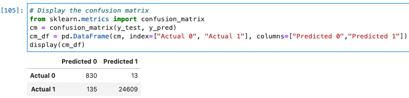
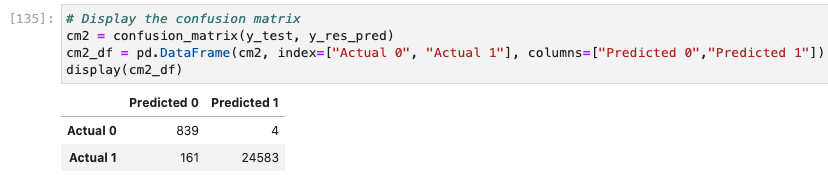
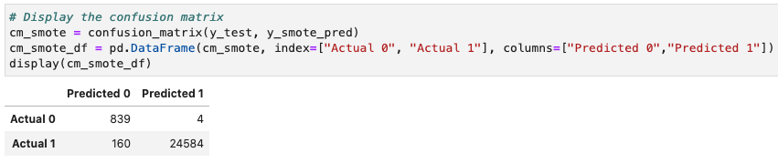
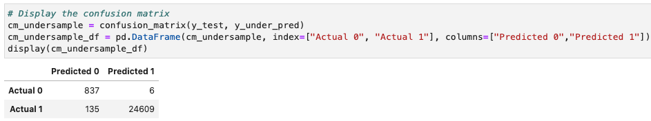
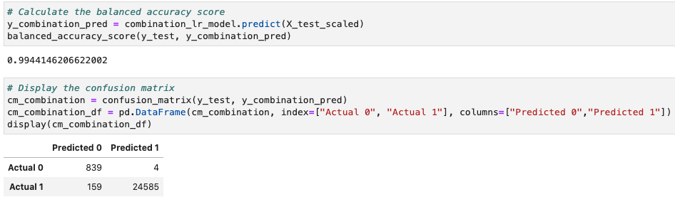
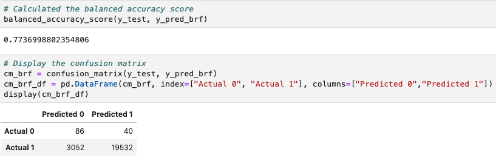
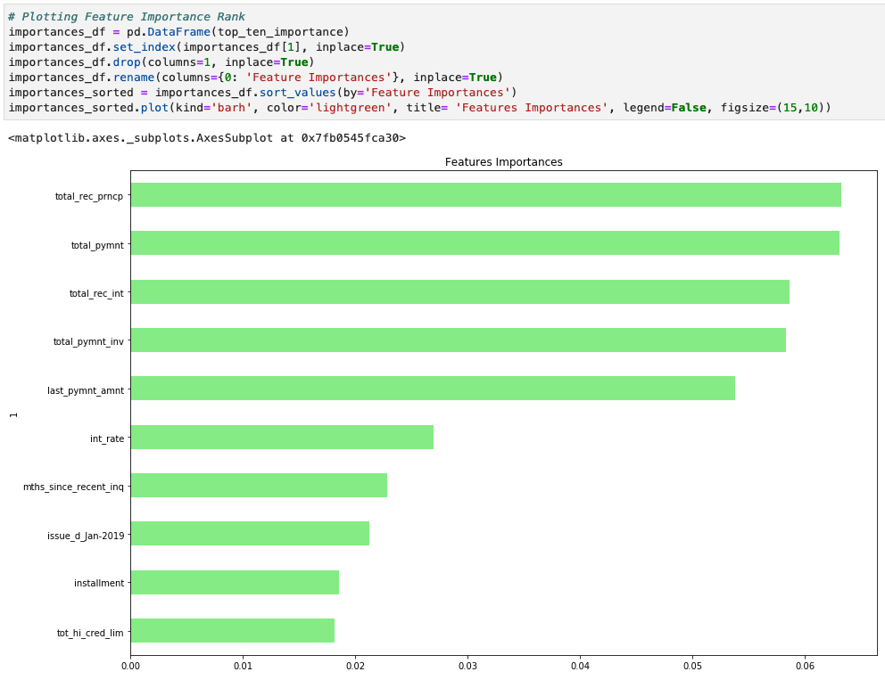
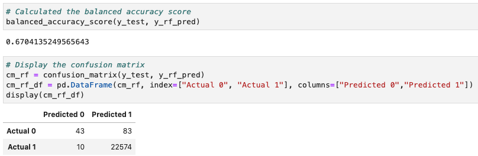

# Unit 11 - Risky Business
 

## Background

Mortgages, student and auto loans, and debt consolidation are just a few examples of credit and loans that people seek online. Peer-to-peer lending services such as Loans Canada and Mogo let investors loan people money without using a bank. However, because investors always want to mitigate risk, a client has asked that you help them predict credit risk with machine learning techniques.

In this assignment, we built and evaluated several machine learning models to predict credit risk using data you'd typically see from peer-to-peer lending services. Credit risk is an inherently imbalanced classification problem (the number of good loans is much larger than the number of at-risk loans). We need to employed different techniques for training and evaluating models with imbalanced classes. I used the imbalanced-learn and Scikit-learn libraries to build and evaluate models using the two following techniques:

1. [Resampling](#Resampling)
2. [Ensemble Learning](#Ensemble-Learning)

- - -

### Files

[Resampling Starter Notebook](Starter_Code/credit_risk_resampling.ipynb)

[Ensemble Starter Notebook](Starter_Code/credit_risk_ensemble.ipynb)

[Lending Club Loans Data](Resources/LoanStats_2019Q1.csv.zip)

- - -

#### Resampling

I used the [imbalanced learn](https://imbalanced-learn.readthedocs.io) library to resample the LendingClub data and build and evaluate logistic regression classifiers using the resampled data.

Process:

1. I read the CSV into a DataFrame.

2. I split the data into Training and Testing sets.

3. I scaled the training and testing data using the `StandardScaler` from `sklearn.preprocessing`.

4. I used the provided code to run a Simple Logistic Regression:
    * Fit the `logistic regression classifier`.
    * Calculate the `balanced accuracy score`.
    * Display the `confusion matrix`.
    * Print the `imbalanced classification report`.

Then I:

1. Oversampled the data using the `Naive Random Oversampler` and `SMOTE` algorithms.

2. Undersampled the data using the `Cluster Centroids` algorithm.

3. Over- and undersampled using a combination `SMOTEENN` algorithm.

For each of the model algorithms above, I:

1. Trained a `logistic regression classifier` from `sklearn.linear_model` using the resampled data.

2. Calculated the `balanced accuracy score` from `sklearn.metrics`.

3. Displayed the `confusion matrix` from `sklearn.metrics`.

4. Printed the `imbalanced classification report` from `imblearn.metrics`.

# My Thoughts To Far:
1. Out of the several sampling models, the Combination (oversample & undersample) model had the best accuracy score with 99.44%. This was slightly better than the SMOTE oversample model
2. The highest recall score resulted in a tie between the combination, random over sampler, and SMOTE models. They all performed very similarly.
3. They all performed pretty evenly when it comes to the geometric score.

## In comparing the methods above, I would go with the combination sampler to avoid oversampling.

#### Ensemble Learning

In this section, I trained and compared two different ensemble classifiers to predict loan risk and evaluate each model. You used the [Balanced Random Forest Classifier](https://imbalanced-learn.readthedocs.io/en/stable/generated/imblearn.ensemble.BalancedRandomForestClassifier.html#imblearn-ensemble-balancedrandomforestclassifier) and the [Easy Ensemble Classifier](https://imbalanced-learn.readthedocs.io/en/stable/generated/imblearn.ensemble.EasyEnsembleClassifier.html#imblearn-ensemble-easyensembleclassifier). Refer to the documentation for each of these to read about the models and see examples of the code.

To begin:

1. I read the data into a DataFrame using the provided starter code.

2. I split the data into training and testing sets.

3. I scaled the training and testing data using the `StandardScaler` from `sklearn.preprocessing`.

Then:

1. I trained the model using the quarterly data from LendingClub provided in the `Resource` folder.

2. I calculated the balanced accuracy score from `sklearn.metrics`.

3. I displayed the confusion matrix from `sklearn.metrics`.

4. I generated a classification report using the `imbalanced_classification_report` from imbalanced learn.

5. I printed the feature importance sorted in descending order (most important feature to least important) along with the feature score for the Balanced Random Forest Classifier model.

- - -
# My Final Thoughts:
1. The Balanced Random Forest model gave us the best score of the 2 models at 77.4%.
2. The Balanced Random Forest model gave me the best recall score of 68%. The Random Forest model gave me the best precision at 81%. 
3. The Balanced Random Forest model gave us the best geometric mean score. Thus, the classification success was higher at 77%.
4. The total recorded principle amount, total payment amount, & total recorded int are the 3 top features.

## In the end, I would select the Balanced Random Forest Model for modeling this set of data.
- - -

© 2020 Trilogy Education Services, a 2U, Inc. brand. All Rights Reserved.
