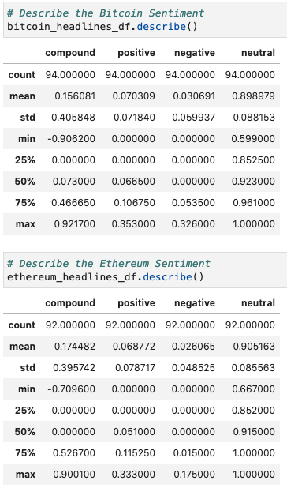
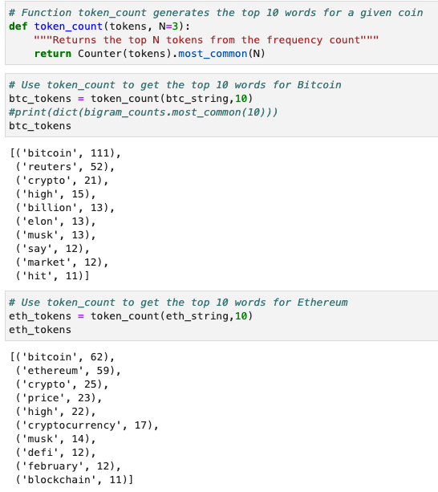

# Unit 12—Tales from the Crypto

## Background

There's been a lot of hype in the news lately about cryptocurrency, so you want to take stock, so to speak, of the latest news headlines regarding Bitcoin and Ethereum to get a better feel for the current public sentiment around each coin.

In this assignment, I applied natural language processing to understand the sentiment in the latest news articles featuring Bitcoin and Ethereum. I also applied fundamental NLP techniques to better understand the other factors involved with the coin prices such as common words and phrases and organizations and entities mentioned in the articles.

I Completed the following tasks:

1. [Sentiment Analysis](#1---Sentiment-Analysis)
2. [Natural Language Processing](#2---Natural-Language-Processing)
3. [Named Entity Recognition](#3---Named-Entity-Recognition)

---

## Files

[Starter Notebook](Starter_Code/crypto_sentiment.ipynb)

---

## Instructions

----

### 1 - Sentiment Analysis

I used the [newsapi](https://newsapi.org/) to pull the latest news articles for Bitcoin and Ethereum and create a DataFrame of sentiment scores for each coin.

I used descriptive statistics to come up with the following sentiment conclusions:

## The Bitcoin had the highest positive mean score.

## The Bitcoin had the highest compound score

## The Bitcoin had the highest positive score.

---

### 2 - Natural Language Processing

In this section, I used NLTK and Python to tokenize text, find n-gram counts, and create word clouds for both coins. 

#### N-grams

These were the top 10 words for the bitcoin & ethereum articles.

#### Word Clouds

Finally, generate word clouds for each coin to summarize the news for each coin.

---

### 3 - Named Entity Recognition

In this section, you will build a named entity recognition model for both coins and visualize the tags using SpaCy.

Please refer to the starter notebook for these visuals.

---

---

© 2020 Trilogy Education Services, a 2U, Inc. brand. All Rights Reserved.
